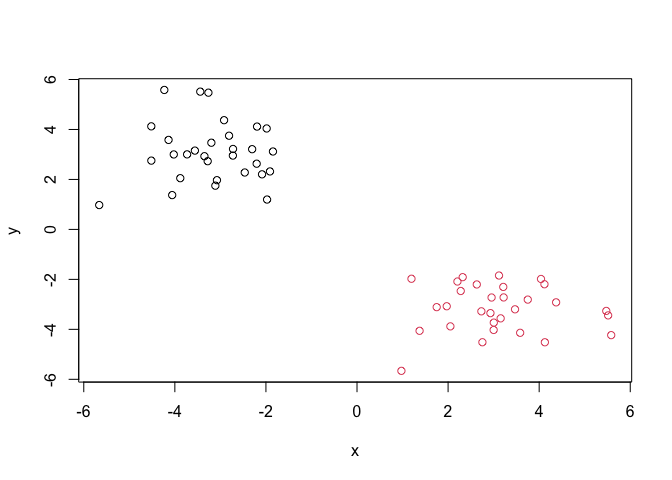

# Class 7: Machine Learning 1
Claire Lua A16922295

- [Clustering](#clustering)
  - [K-means](#k-means)
- [Hierarchical Clustering](#hierarchical-clustering)
- [Principal Component Analysis
  (PCA)](#principal-component-analysis-pca)
  - [Data import](#data-import)
  - [PCA to the rescue](#pca-to-the-rescue)

Today we will explore unsupervised machine learning methods starting
with clustering and dimensionality reduction

## Clustering

To start let’s make up some data to cluster where we know what the
answer should be. The `rnorm()` function will help us here.

``` r
hist(rnorm(10000, mean=3))
```


Return 30 numbers centered on -3

``` r
tmp <- c( rnorm(30, mean=-3),
       rnorm(30, mean=+3) )

x <- cbind(x=tmp, y=rev(tmp))

x
```

                   x          y
     [1,] -4.0237215  3.0003532
     [2,] -4.0585860  1.3738154
     [3,] -2.4650368  2.2777781
     [4,] -2.0854316  2.2050181
     [5,] -3.5600986  3.1540669
     [6,] -1.8454579  3.1182901
     [7,] -2.3027405  3.2113051
     [8,] -1.9839529  4.0401356
     [9,] -3.0754790  1.9703968
    [10,] -4.1385068  3.5821132
    [11,] -2.8097807  3.7496222
    [12,] -4.2315739  5.5816713
    [13,] -2.7258771  2.9549622
    [14,] -4.5163023  2.7533728
    [15,] -4.5172416  4.1253224
    [16,] -1.9746553  1.1957981
    [17,] -3.2631610  5.4731577
    [18,] -2.2033293  2.6301812
    [19,] -3.7309553  3.0035632
    [20,] -3.3507081  2.9298634
    [21,] -2.9192017  4.3719052
    [22,] -2.7225807  3.2194909
    [23,] -2.1949279  4.1160012
    [24,] -3.8808445  2.0504152
    [25,] -5.6610997  0.9748271
    [26,] -3.2788146  2.7307443
    [27,] -3.1106918  1.7500322
    [28,] -1.9106522  2.3208201
    [29,] -3.1981786  3.4698447
    [30,] -3.4416967  5.5144154
    [31,]  5.5144154 -3.4416967
    [32,]  3.4698447 -3.1981786
    [33,]  2.3208201 -1.9106522
    [34,]  1.7500322 -3.1106918
    [35,]  2.7307443 -3.2788146
    [36,]  0.9748271 -5.6610997
    [37,]  2.0504152 -3.8808445
    [38,]  4.1160012 -2.1949279
    [39,]  3.2194909 -2.7225807
    [40,]  4.3719052 -2.9192017
    [41,]  2.9298634 -3.3507081
    [42,]  3.0035632 -3.7309553
    [43,]  2.6301812 -2.2033293
    [44,]  5.4731577 -3.2631610
    [45,]  1.1957981 -1.9746553
    [46,]  4.1253224 -4.5172416
    [47,]  2.7533728 -4.5163023
    [48,]  2.9549622 -2.7258771
    [49,]  5.5816713 -4.2315739
    [50,]  3.7496222 -2.8097807
    [51,]  3.5821132 -4.1385068
    [52,]  1.9703968 -3.0754790
    [53,]  4.0401356 -1.9839529
    [54,]  3.2113051 -2.3027405
    [55,]  3.1182901 -1.8454579
    [56,]  3.1540669 -3.5600986
    [57,]  2.2050181 -2.0854316
    [58,]  2.2777781 -2.4650368
    [59,]  1.3738154 -4.0585860
    [60,]  3.0003532 -4.0237215

Make a plot of `x`

``` r
plot(x)
```


### K-means

The main function in “base” R for K-means clustering is called
`kmeans()`

``` r
km <- kmeans(x, centers=2)
km
```

    K-means clustering with 2 clusters of sizes 30, 30

    Cluster means:
              x         y
    1  3.094976 -3.172709
    2 -3.172709  3.094976

    Clustering vector:
     [1] 2 2 2 2 2 2 2 2 2 2 2 2 2 2 2 2 2 2 2 2 2 2 2 2 2 2 2 2 2 2 1 1 1 1 1 1 1 1
    [39] 1 1 1 1 1 1 1 1 1 1 1 1 1 1 1 1 1 1 1 1 1 1

    Within cluster sum of squares by cluster:
    [1] 66.58355 66.58355
     (between_SS / total_SS =  89.8 %)

    Available components:

    [1] "cluster"      "centers"      "totss"        "withinss"     "tot.withinss"
    [6] "betweenss"    "size"         "iter"         "ifault"      

The `kmeans()` function return a “list” with 9 components. You can see
the named components of any list with the `attributes()` function.

``` r
attributes(km)
```

    $names
    [1] "cluster"      "centers"      "totss"        "withinss"     "tot.withinss"
    [6] "betweenss"    "size"         "iter"         "ifault"      

    $class
    [1] "kmeans"

> Q. How many points are in each clister?

``` r
km$size
```

    [1] 30 30

> Q. Cluster assignment/membership vector?

``` r
km$cluster
```

     [1] 2 2 2 2 2 2 2 2 2 2 2 2 2 2 2 2 2 2 2 2 2 2 2 2 2 2 2 2 2 2 1 1 1 1 1 1 1 1
    [39] 1 1 1 1 1 1 1 1 1 1 1 1 1 1 1 1 1 1 1 1 1 1

> Q. Cluster centers?

``` r
km$centers
```

              x         y
    1  3.094976 -3.172709
    2 -3.172709  3.094976

> Q. Make a plot of our `kmeans()` results showing cluster assignment
> using different colors for each cluster/group of points and cluster
> centers in blue

``` r
plot(x,col=km$cluster)
points(km$centers, col="blue", pch=15, cex=2)
```


> Q. Run `kmeans()` again on `x` and this cluster into 4 groups/clusters
> and plot the same result figure as above

``` r
km4 <- kmeans(x, centers=4)
km4
```

    K-means clustering with 4 clusters of sizes 20, 20, 10, 10

    Cluster means:
              x         y
    1 -3.124153  2.441255
    2  2.441255 -3.124153
    3 -3.269822  4.402419
    4  4.402419 -3.269822

    Clustering vector:
     [1] 1 1 1 1 1 1 1 3 1 3 3 3 1 1 3 1 3 1 1 1 3 1 3 1 1 1 1 1 3 3 4 4 2 2 2 2 2 4
    [39] 2 4 2 2 2 4 2 4 2 2 4 4 4 2 4 2 2 2 2 2 2 2

    Within cluster sum of squares by cluster:
    [1] 28.35381 28.35381 12.44717 12.44717
     (between_SS / total_SS =  93.8 %)

    Available components:

    [1] "cluster"      "centers"      "totss"        "withinss"     "tot.withinss"
    [6] "betweenss"    "size"         "iter"         "ifault"      

``` r
plot(x,col=km4$cluster)
points(km4$centers, col="pink", pch=15, cex=2)
```


> **key point**: K-means clustering is super popular but can be
> miss-used. One big limitation is that it can impose a clustering
> pattern on your data even if clear natural grouping don’t exist -
> i.e. it does what you tell it to do in terms of `centers`

## Hierarchical Clustering

The main function in “base” R for hierarchical clustering is called
`hclust()`

You can’t just pass our dataset as is into `hclust()` you must give
“distance matrix” as input. We can get this from the `dist()` function
in R.

``` r
d <- dist(x)
hc <- hclust(d)
hc
```


    Call:
    hclust(d = d)

    Cluster method   : complete 
    Distance         : euclidean 
    Number of objects: 60 

The result of `hclust()` don’t have a useful `print()` method but do
have a special `plot()` method

``` r
plot(hc)
abline(h=8, col="red")
```


To get our main cluster assignment (membership vector) we need to “cut”
the tree at the big goal posts…

``` r
grps <- cutree(hc, h=8)
grps
```

     [1] 1 1 1 1 1 1 1 1 1 1 1 1 1 1 1 1 1 1 1 1 1 1 1 1 1 1 1 1 1 1 2 2 2 2 2 2 2 2
    [39] 2 2 2 2 2 2 2 2 2 2 2 2 2 2 2 2 2 2 2 2 2 2

``` r
table(grps)
```

    grps
     1  2 
    30 30 

``` r
plot(x, col=grps)
```



Hierarchical Clustering is distinct in that the dendrogram (tree figure)
can reveal the potential grouping in your data (unlike K-means)

## Principal Component Analysis (PCA)

PCA is a common and highly useful dimensionality reduction technique
used in many fields - particularly bioinformatics.

Here we will analyze some data from the UK on food consumption.

### Data import

``` r
url <- "https://tinyurl.com/UK-foods"
x <- read.csv(url)

head(x)
```

                   X England Wales Scotland N.Ireland
    1         Cheese     105   103      103        66
    2  Carcass_meat      245   227      242       267
    3    Other_meat      685   803      750       586
    4           Fish     147   160      122        93
    5 Fats_and_oils      193   235      184       209
    6         Sugars     156   175      147       139

``` r
x <- read.csv(url, row.names=1)
head(x)
```

                   England Wales Scotland N.Ireland
    Cheese             105   103      103        66
    Carcass_meat       245   227      242       267
    Other_meat         685   803      750       586
    Fish               147   160      122        93
    Fats_and_oils      193   235      184       209
    Sugars             156   175      147       139

``` r
barplot(as.matrix(x), beside=T, col=rainbow(nrow(x)))
```


``` r
barplot(as.matrix(x), beside=F, col=rainbow(nrow(x)))
```


One conventional plot that can be useful is called a “pairs” plot

``` r
pairs(x, col=rainbow(10), pch=16)
```


### PCA to the rescue

The main function in base R for PCA is called `prcomp()`.

``` r
pca <- prcomp(t(x))
summary(pca)
```

    Importance of components:
                                PC1      PC2      PC3       PC4
    Standard deviation     324.1502 212.7478 73.87622 2.921e-14
    Proportion of Variance   0.6744   0.2905  0.03503 0.000e+00
    Cumulative Proportion    0.6744   0.9650  1.00000 1.000e+00

The `prcomp()` function returns a list object of our result with 5
attributes/components

``` r
attributes(pca)
```

    $names
    [1] "sdev"     "rotation" "center"   "scale"    "x"       

    $class
    [1] "prcomp"

The two main “results” in here are `pca$x` and `pca$rotation`. The first
of these (`pca$x`) contains the scores of the data on the new PC axis -
we use these to make our “PCA plot”.

``` r
pca$x
```

                     PC1         PC2        PC3           PC4
    England   -144.99315   -2.532999 105.768945 -9.152022e-15
    Wales     -240.52915 -224.646925 -56.475555  5.560040e-13
    Scotland   -91.86934  286.081786 -44.415495 -6.638419e-13
    N.Ireland  477.39164  -58.901862  -4.877895  1.329771e-13

``` r
library(ggplot2)
library(ggrepel)

# Make a plot of pca$x with PC1 vs PC2

ggplot(pca$x, aes(PC1, PC2, label=rownames(pca$x))) +
  geom_point() +
  geom_text_repel()
```


``` r
# PC1 affect the data the most according to how much they are scattered
# In this graph, we are comparing the four data points in regard to PC1 and PC2 
```

The second major result is contained in the `pca$rotation` object or
component. Let’s plot this to see what PCA is picking up…

``` r
ggplot(pca$rotation) +
  aes(PC1, rownames(pca$rotation)) +
  geom_col()
```


``` r
# For this graph, we are just comparing the "food" data point in the PC1 dimension
# The bar plot demonstrates how much each food variable contributes to PC1, with more influence shown by more positive/negative values
```
